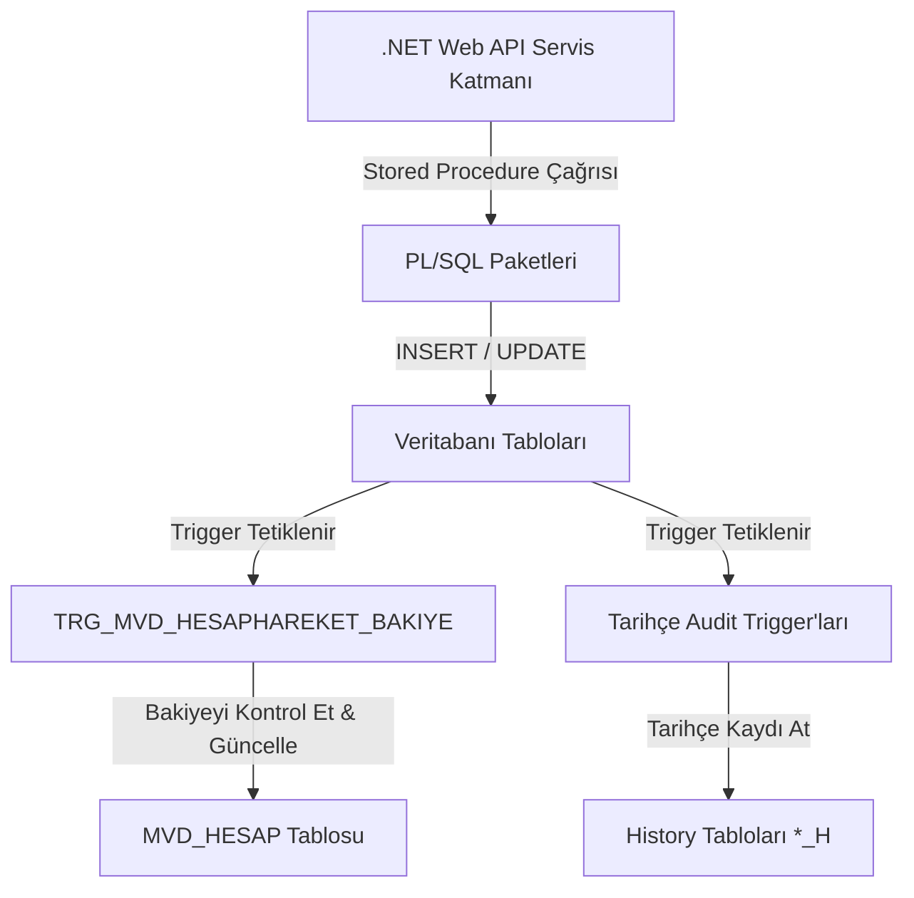
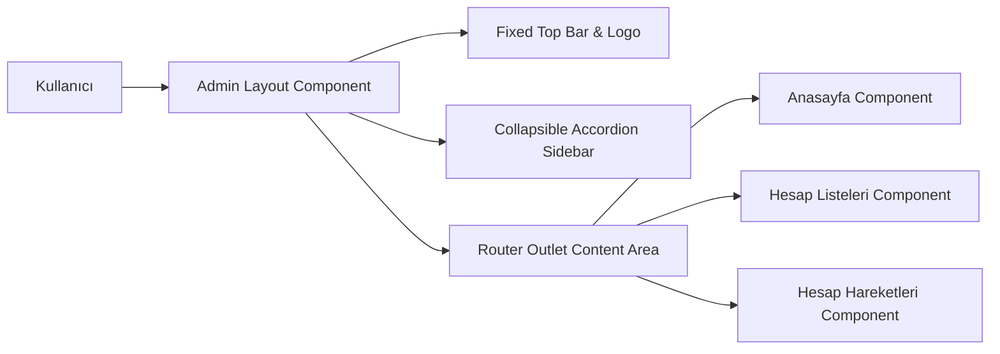
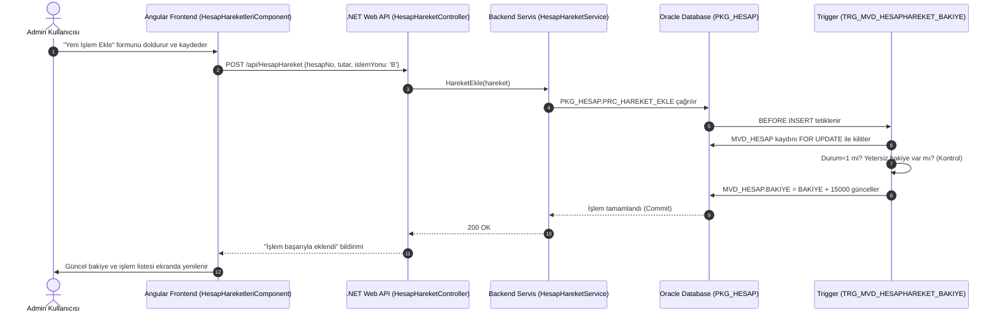

# Bankacılık ve Muhasebe Sistemi — Uçtan Uca Mimari ve İşlevsel Analiz Raporu

Bu belge, **Bankacılık ve Muhasebe Sistemi**'nin Veritabanı (Oracle PL/SQL Triggers & Packages/Procedures), Backend (.NET Web API) ve Frontend (Angular) katmanlarındaki mimarisini, veri akışını, kilit mekanizmalarını ve iş kurallarını adım adım detaylandırmaktadır.

---

## 1. Veritabanı Katmanı (Oracle PL/SQL Mimarisi)

Sistemin çekirdek iş mantığı, veri tutarlılığı, bakiye hesaplamaları ve denetim (audit) izleri doğrudan Oracle veritabanı seviyesinde yönetilmektedir.



---

### 1.1 Trigger (Tetikleyici) Mimarisi (`02_Triggers.sql`)

Trigger'lar, tablo üzerinde bir `INSERT`, `UPDATE` veya `DELETE` işlemi gerçekleştiğinde otomatik çalışan kurallardır.

#### A. İşlem Hareketi ve Bakiye Trigger'ı (`TRG_MVD_HESAPHAREKET_BAKIYE`)
Sistemin finansal tutarlılığını sağlayan en kritik bileşendir.
* **Tetiklenme Zamanı:** `BEFORE INSERT ON MVD_HESAPHAREKET FOR EACH ROW` (Her yeni hesap hareketi eklenmeden hemen önce çalışır).
* **Satır Seviyesinde Kilit (Pessimistic Locking):**
  ```sql
  SELECT BAKIYE, DURUM INTO V_MEVCUT_BAKIYE, V_HESAP_DURUM
    FROM MVD_HESAP
   WHERE HESAP_NO = :NEW.HESAP_NO
     FOR UPDATE; -- Eşzamanlı işlemlerde yarışı (race condition) önlemek için hesabı kilitler.
  ```
* **İş Kuralları ve Kontroller:**
  1. **Hesap Durum Kontrolü:** Eğer hesap pasif veya kapalı ise (`DURUM != 1`), `RAISE_APPLICATION_ERROR(-20001, 'Hesap aktif degil.')` ile işlem reddedilir.
  2. **İşlem Yönü Kontrolü:**
     - **`B` (Para Girişi / Borç):** `:NEW.YENI_BAKIYE := V_MEVCUT_BAKIYE + :NEW.ISLEM_TUTARI`
     - **`C` (Para Çıkışı / Cari):**
       - Yetersiz Bakiye Kontrolü: Eğer `V_MEVCUT_BAKIYE < :NEW.ISLEM_TUTARI` ise `RAISE_APPLICATION_ERROR(-20002, 'Yetersiz bakiye.')` fırlatılır.
       - Yeni bakiye: `:NEW.YENI_BAKIYE := V_MEVCUT_BAKIYE - :NEW.ISLEM_TUTARI`
  3. **Otomatik Bakiye Güncellemesi:**
     ```sql
     UPDATE MVD_HESAP
        SET BAKIYE = :NEW.YENI_BAKIYE
      WHERE HESAP_NO = :NEW.HESAP_NO;
     ```

#### B. Audit Log (Tarihçe) Trigger'ları
Tüm ana tablolarda (`MST_MUSTERI`, `MST_MUSTERIADRES`, `MVD_HESAP`, `MVD_HESAPHAREKET`) yapılan her değişikliği geri dönük izlenebilirlik amacıyla tarihçe tablosuna (`*_H`) aktarır.
* **Tetiklenme Zamanı:** `AFTER INSERT OR UPDATE OR DELETE ON [TABLO] FOR EACH ROW`
* **İşlem Tipi Algılama:**
  - `INSERT` işlemi için `H_ISLEM_TIPI = 'I'`
  - `UPDATE` işlemi için `H_ISLEM_TIPI = 'U'`
  - `DELETE` işlemi için `H_ISLEM_TIPI = 'D'`
* **Otomatik Sequence Kullanımı:** Her tarihçe kaydı `SEQ_ISLEM_H_ID.NEXTVAL` ile benzersiz bir `H_ID` alır ve işlemi gerçekleştiren veritabanı kullanıcısını (`USER`) zaman damgasıyla (`SYSTIMESTAMP`) kaydeder.

---

### 1.2 Paket ve Stored Procedure Mimarisi (`03_Procedures.sql`)

İş mantığı ve SQL sorguları **Package Specification** (Tanım) ve **Package Body** (Gövde) mimarisiyle modüler hale getirilmiştir.

#### A. `PKG_MUSTERI` Paketi
Müşteri ve müşteri adreslerinin yaşam döngüsünü yönetir.
* `PRC_MUSTERI_EKLE`: Email veya TCKN/VKN mükerrerlik kontrolü yapar. Benzersiz `MUSTERI_ID` döndürür (`OUT`).
* `PRC_MUSTERI_GUNCELLE`: Başka bir müşteride aynı Email veya TCKN kullanımını engeller.
* `PRC_MUSTERI_SIL`: Müşteri kaydını siler. (FK Cascade kuralı ile adresleri otomatik silinir).
* `PRC_MUSTERI_GETIR` & `PRC_MUSTERI_LISTE`: Müşterileri `SYS_REFCURSOR` kullanarak uygulamaya döndürür.
* `PRC_ADRES_EKLE` / `PRC_ADRES_GUNCELLE` / `PRC_ADRES_SIL`: Adres işlemlerini gerçekleştirir.

#### B. `PKG_HESAP` Paketi
Hesap açma, durum güncelleme ve hesap hareketleri takibini yürütür.
* `PRC_HESAP_EKLE`: Müşterinin varlığını teyit eder, benzersiz hesap numarası ve IBAN ile hesabı oluşturur.
* `PRC_HESAP_DURUM_GUNCELLE`: Hesabı Aktif (1), Pasif (2) veya Kapalı (3) durumuna getirir.
* `PRC_HAREKET_EKLE`: Yeni hareket kaydı açar; arka planda `TRG_MVD_HESAPHAREKET_BAKIYE` trigger'ını tetikler.
* `PRC_HESAP_LISTE` & `PRC_HAREKET_LISTE`: Tüm hesap ve hareket verilerini imleç (`SYS_REFCURSOR`) ile API'ye iletir.

#### C. `PKG_DASHBOARD` Paketi
Yönetici ana sayfasındaki istatistikleri **tek bir veritabanı çağrısında** toplar.
* `PRC_GET_SUMMARY`: 4 farklı `SYS_REFCURSOR` parametresi döndürür:
  1. `P_MUSTERI_STATS`: Aktif, Bireysel, Tüzel ve Toplam Müşteri sayıları.
  2. `P_HESAP_STATS`: Döviz cinslerine göre toplam bakiyeler, vadeli/vadesiz hesap sayıları.
  3. `P_HACIM_STATS`: Tüm hesap hareketlerinin döviz ve işlem yönü bazında toplam hacmi (`SUM(ISLEM_TUTARI)`).
  4. `P_SON_ISLEMLER`: Sistemde yapılan en son 10 işlem hareketi.

---

## 2. Backend Katmanı (.NET 10 Web API Mimarisi)

C# Backend katmanı, Oracle veritabanı ile Angular frontend arasında güvenli ve performanslı bir köprü oluşturur.

### 2.1 Oracle ODP.NET Entegrasyonu ve Parametre Bağlama
* **`cmd.BindByName = true;` kuralı:** Oracle ODP.NET kütüphanesinde varsayılan olarak parametreler sıraya göre bağlanır. İsimli parametrelerin (`P_RESULT`, `P_HESAP_NO` vb.) doğru çalışması için serviste `BindByName = true` zorunludur.
* **`SYS_REFCURSOR` Okuma:** 
  ```csharp
  cmd.Parameters.Add("p_result", OracleDbType.RefCursor, ParameterDirection.Output);
  using (OracleDataReader reader = cmd.ExecuteReader()) {
      while (reader.Read()) { ... }
  }
  ```

### 2.2 Dayanıklılık ve Fallback (Yedek Sorgu) Mimarisi
Eğer veritabanındaki paket veya prosedür derlenmemişse uygulamanın `500 Internal Server Error` vermesini engellemek için servislerde yedekleme mantığı mevcuttur:
```csharp
try {
    // Önce PL/SQL Paket Prosedürünü Çalıştır
    using (OracleCommand cmd = new OracleCommand("PKG_HESAP.PRC_HAREKET_LISTE", connection)) { ... }
}
catch (OracleException ex) when (ex.Number == 6550 || ex.Message.Contains("PRC_HAREKET_LISTE")) {
    // Prosedür bulunamazsa Doğrudan ANSI SQL Sorgusuna Düş
    string fallbackQuery = "SELECT ... FROM MVD_HESAPHAREKET ORDER BY ISLEM_TARIHI DESC";
    ...
}
```

### 2.3 Çoklu İmleç Okuma (`NextResult()`)
`DashboardService`, `PKG_DASHBOARD.PRC_GET_SUMMARY` prosedüründen dönen 4 farklı imleci sırayla okur:
```csharp
using (OracleDataReader reader = cmd.ExecuteReader()) {
    // 1. Cursor: Müşteri İstatistikleri
    if (reader.Read()) { ... }
    
    // 2. Cursor: Hesap İstatistikleri
    if (reader.NextResult()) { while(reader.Read()) { ... } }
    
    // 3. Cursor: Hacim İstatistikleri
    if (reader.NextResult()) { while(reader.Read()) { ... } }
    
    // 4. Cursor: Son İşlemler
    if (reader.NextResult()) { while(reader.Read()) { ... } }
}
```

---

## 3. Frontend Katmanı (Angular 19 Standalone Mimarisi)

Arayüz katmanı, kullanıcı deneyimini (UX) üst seviyede tutmak için modüler component'ler ve reactive servisler kullanır.



### 3.1 Arayüz Düzeni ve Düzen Dengesi (Layout Alignment)
* **Sabit Üst Bar (`.top-header`):** `80px` sabit yükseklikte, logo ve admin profil bilgilerini içeren tam genişlikte bar.
* **Kaydırma İzolasyonu (`overflow: hidden`):** Sayfa kaydırıldığında sadece içerik alanı (`.main-content`) hareket eder; üst header ve çizgi dengesi asla bozulmaz.
* **Katlanmış Menüler:** Müşteri ve Hesaplar akordeon butonları sayfa açıldığında varsayılan olarak kapalı (`false`) gelir.

### 3.2 Sabit Tabanlı Sayfalama (Pagination Stability)
* Tablo konteynerine `min-height: 480px` tanımlanarak sayfa değiştirmede tablonun zıplaması önlenmiştir.
* Modern sayfalama çubuğu: `‹ Önceki` ve `Sonraki ›` butonları, toplam kayıt bilgisi ("Toplam 25 kayıttan 1 - 10 arası gösteriliyor") mevcuttur.

---

## 4. Uçtan Uca Örnek Veri Akış Senaryosu

**Senaryo:** Admin kullanıcısının sistem üzerinden **Ahmet Yılmaz** hesabına `15.000 TL` para aktarımı (EFT/FAST) kaydetmesi.



---

## 5. Özet ve Sistem Özellikleri Matrix'i

| Katman | Kullanılan Teknolojiler / Yapılar | Sağladığı Avantaj |
| :--- | :--- | :--- |
| **Veritabanı** | Oracle PL/SQL, Triggers, RefCursor | Veri tutarlılığı, eşzamanlı kilitlenme (Pessimistic Lock), denetim izi |
| **Backend** | .NET 10 Web API, ODP.NET, Transactions | Yüksek performans, prosedür yedekleme (fallback), güvenli API |
| **Frontend** | Angular 19, TypeScript, Vanilla CSS | Dinamik kartlar, duyarlı (responsive) tasarım, sıçramasız sayfalama |
